# **Project Proposal: Text Highlighting and Background Removal**

## **1. Purpose**

The project aims to process images of handwritten or printed documents by enhancing text visibility and removing uneven
backgrounds. It addresses common issues like uneven lighting, camera distortions, and noise, producing clean, readable
outputs suitable for digitization and analysis.

---

## **2. Main Functionalities**

### **2.1 Document Detection**

- Detects the boundary of a document in an image, isolates it, and warps it to fit a standard A4 size.
- Utilizes:
    - **LAB color space conversion** to emphasize lightness.
    - **Thresholding** and **morphological operations** to segment the document from the background.
    - **Contour detection** to approximate the document boundary.
    - **Perspective transformation** to correct skew and map the document to an A4 format.

### **2.2 Text Enhancement and Highlighting**

- Enhances the detected document by:
    - **Noise reduction**: Smoothens the image to remove high-frequency noise.
    - **Adaptive thresholding**: Dynamically segments the text and background.
    - **Morphological processing**: Removes small noise and consolidates text regions.
    - **Mask filling**: Fills background regions with white while optionally replacing text with Obsidian Black.
    - **Text highlighting**: Detects and highlights text regions with bounding boxes, combining overlapping boxes for
      clarity.

---

## **3. Implementation Details**

- **Languages and Tools**:
    - Python 3.x, with OpenCV for image processing and NumPy for numerical operations.
- **Pipeline Components**:
    - **Document detection**: Extracts and corrects the document perspective.
    - **Preprocessing**: Noise reduction, color space conversion, adaptive thresholding, and morphological filtering.
    - **Postprocessing**: Text enhancement, background removal, and highlighting.
- **Input Requirements**:
    - Images captured via smartphone or scanner.
    - The document should be fully visible, ideally A4 size, with a contrasting background.
    - Adequate resolution: 300 DPI for scans or 8 MP for photos.
    - Minimal skew or extreme angles.
- **Output**:
    - Cleaned, enhanced images saved as PNG.
    - Key Features:
        - **Document Background Whitening**: Removes uneven white regions, replacing them with uniform white.
        - **Text Highlighting**: Draws bounding boxes around detected text regions (`--highlight_text_regions`).
        - **Text Blackening**: Option to replace text with Obsidian Black or preserve the original color
          (`--force_black_text`).

---

## **4. Expected Outcome**

- **Enhanced readability**: Sharper and clearer text for digitization and OCR.
- **Document background whitening**: Removes uneven lighting and noise in white regions.
- **Perspective correction**: Aligns documents to a standard A4 format.
- **Text blackening**: Optionally replaces text with Obsidian Black for document-style clarity.
- **Highlighting**: Text regions boxed for further analysis.

---

## **5. Contributions**

### **5.1 Document Detection**

- **Features**:
    - Converted images to LAB color space for better separation of lightness.
    - Applied thresholding and morphological operations to isolate the document.
    - Used contour detection to approximate the document boundary.
    - Employed perspective transformation to correct skew.
- **Libraries Used**:
    - OpenCV: `cv2.cvtColor`, `cv2.threshold`, `cv2.findContours`, `cv2.getPerspectiveTransform`.
- **Challenges**:
    - Adaptive thresholding introduced excessive noise and was replaced with fixed thresholding.
    - Non-quadrilateral contours required fallback mechanisms like minimum-area rectangles.
- **Possible Improvements**:
    - Implement machine learning for robust document boundary detection.

### **5.2 Text Enhancement and Highlighting**

- **Features**:
    - **Noise reduction**: Applied Gaussian blur to smoothen images.
    - **Adaptive thresholding**: Dynamically segmented text from the background.
    - **Morphological processing**: Removed small dots and emphasized text.
    - **Mask filling**: Allowed background removal and optional text replacement.
    - **Text highlighting**: Used connected components analysis to draw bounding boxes and combined close regions.
- **Libraries Used**:
    - OpenCV: `cv2.GaussianBlur`, `cv2.adaptiveThreshold`, `cv2.morphologyEx`, `cv2.connectedComponentsWithStats`.
- **Challenges**:
    - Combining bounding boxes efficiently required custom merging logic.
- **Possible Improvements**:
    - Implement deep learning-based text detection for higher accuracy.

---

## **6. Example Outputs**

### **6.1 Input Images**

#### **BLITZ_UP_CLEAN**

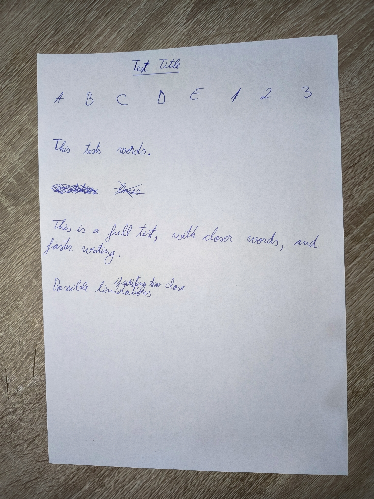  
Captured with a blitz (flash) in an upright orientation. The document appears clean, with no significant shadows.

#### **BLITZ_UP_SHADOW**

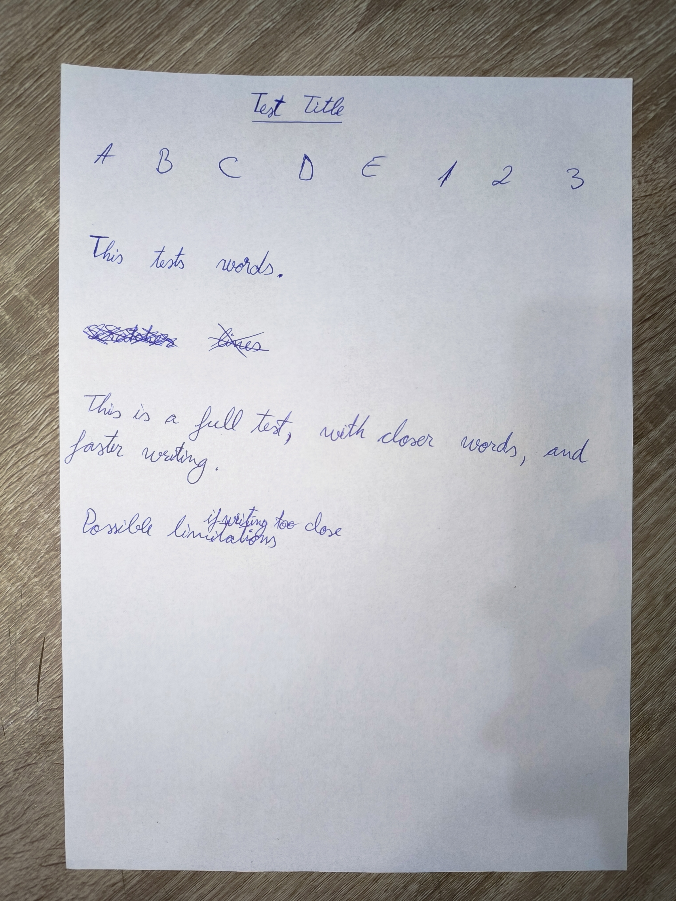  
Taken with a blitz (flash) in an upright orientation. The document contains visible shadows likely caused by uneven
lighting or object interference.

#### **BRIGHT_LEFT_SHADOW**

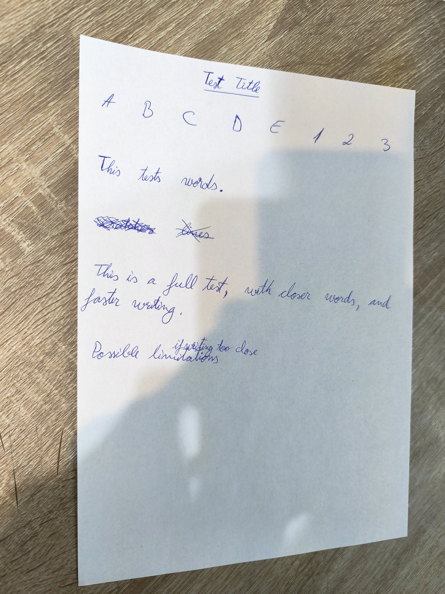  
Photographed with bright ambient lighting from the left side. Shadows are present, likely due to uneven light
distribution.

#### **NATURAL_DOWN_SHADOW**

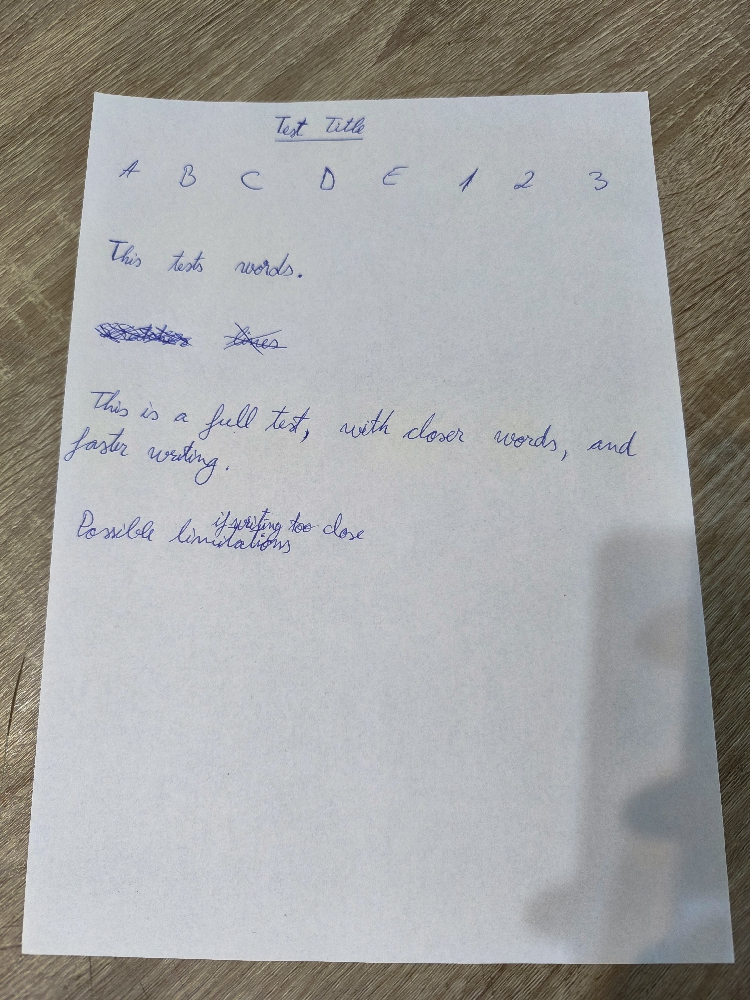  
Captured using natural light coming from above. Shadows are noticeable, impacting the visibility of some parts of the
document.

#### **NATURAL_UP_CLEAN**

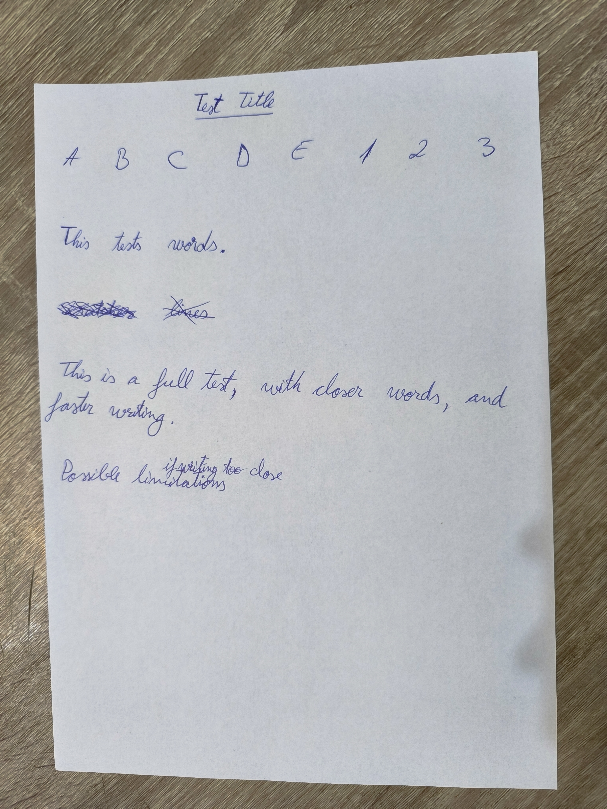  
Taken in natural light in an upright orientation. The document appears clean, with no significant shadows or
distortions.

#### **RIGHT_CLEAN**

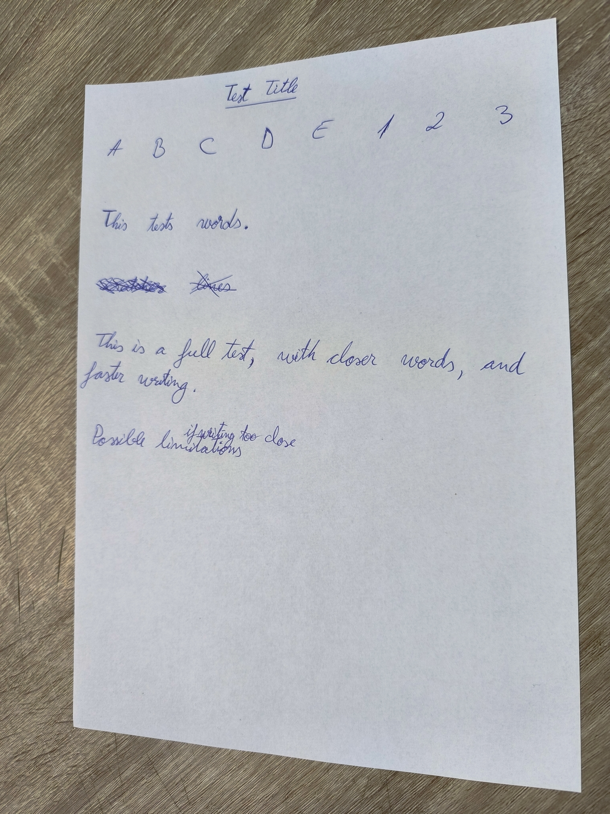  
Captured with the light source on the right. The document is clean, with no visible shadows or lighting issues.

### **6.2 Processed Outputs**

#### **Without `--highlight_text_regions` and `--force_black_text`**

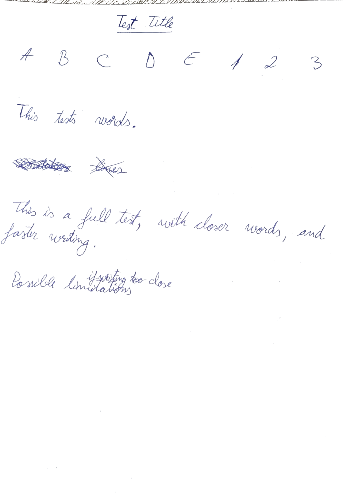
These images display the processed output with no text highlighting or text blackening applied. This shows the baseline
pipeline results focused solely on cleaning and enhancing the document background.

#### **With `--highlight_text_regions` and `--force_black_text`**

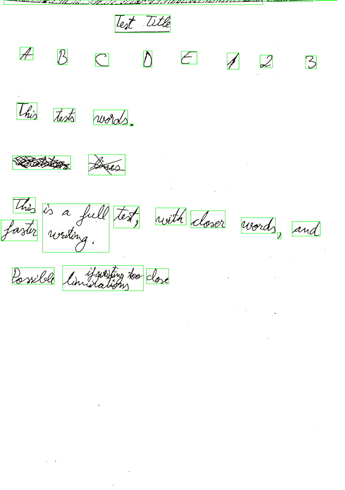
These images demonstrate the pipeline's advanced functionalities, including text highlighting with bounding boxes and
replacing text color with Obsidian Black (#0B1215). This comparison highlights the visual impact of these features.

#### **Final Results**

#### **Final Results**

##### **Successful Cases**

###### **BLITZ_UP_CLEAN_processed_cropped**

  
**Description**: Captured with a flash (BLITZ), upright (UP) orientation, and clean (CLEAN) background. The pipeline
successfully enhanced the image, removed background noise, and preserved document clarity.

###### **BLITZ_UP_SHADOW_processed_cropped**

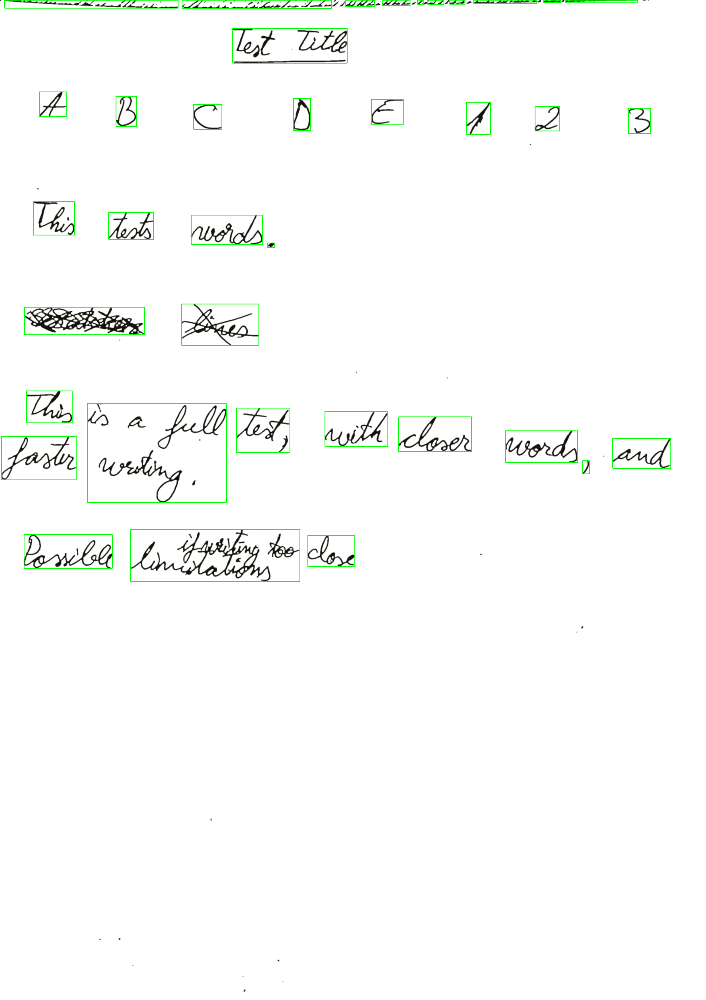  
**Description**: Captured with a flash (BLITZ), upright (UP) orientation, and containing shadows (SHADOW). The pipeline
managed to enhance the text regions despite the shadowed areas.

###### **NATURAL_DOWN_SHADOW_processed_cropped**

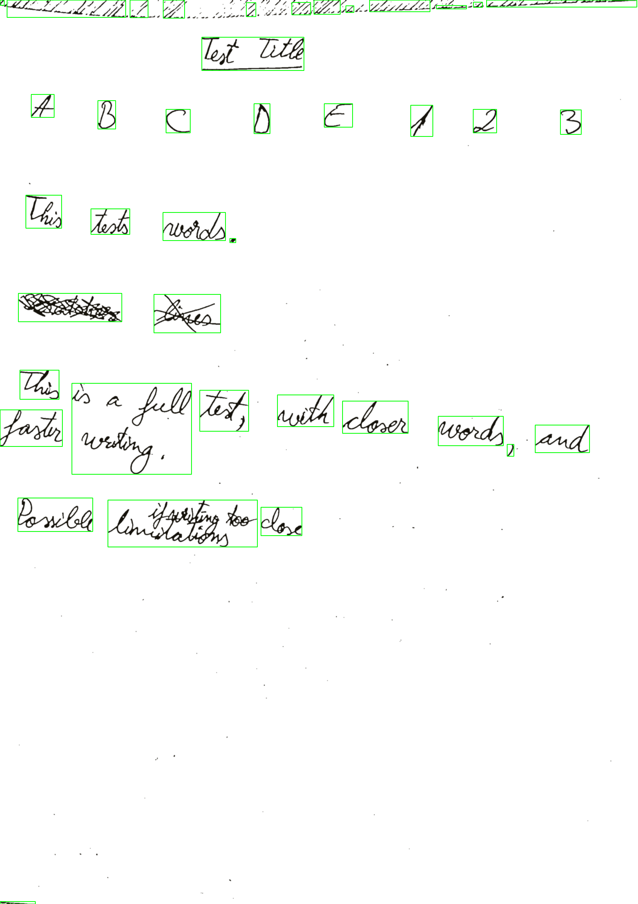  
**Description**: Captured under natural light (NATURAL), in a downward (DOWN) orientation, and with shadows (SHADOW).
The pipeline effectively processed the text while minimizing the impact of uneven lighting.

###### **NATURAL_UP_CLEAN_processed_cropped**

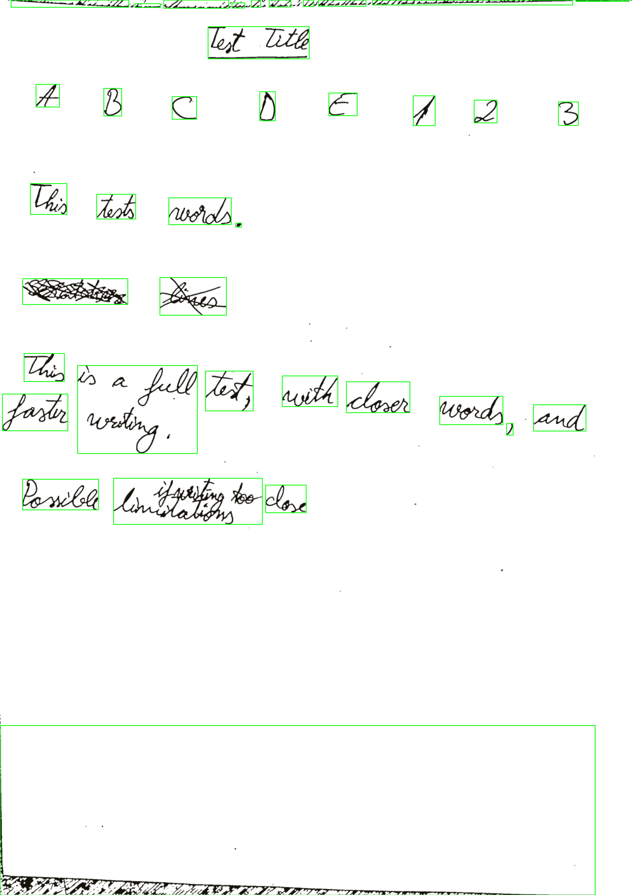  
**Description**: Captured under natural light (NATURAL), upright (UP) orientation, and clean (CLEAN) background. The
pipeline produced excellent results, removing noise and enhancing text clarity.

##### **Failed Cases**

###### **BRIGHT_LEFT_SHADOW_processed_cropped**

  
**Description**: Captured under bright light (BRIGHT), from the left (LEFT) orientation, and with shadows (SHADOW). The
pipeline struggled with uneven lighting and shadow detection.

###### **RIGHT_CLEAN_processed_cropped**

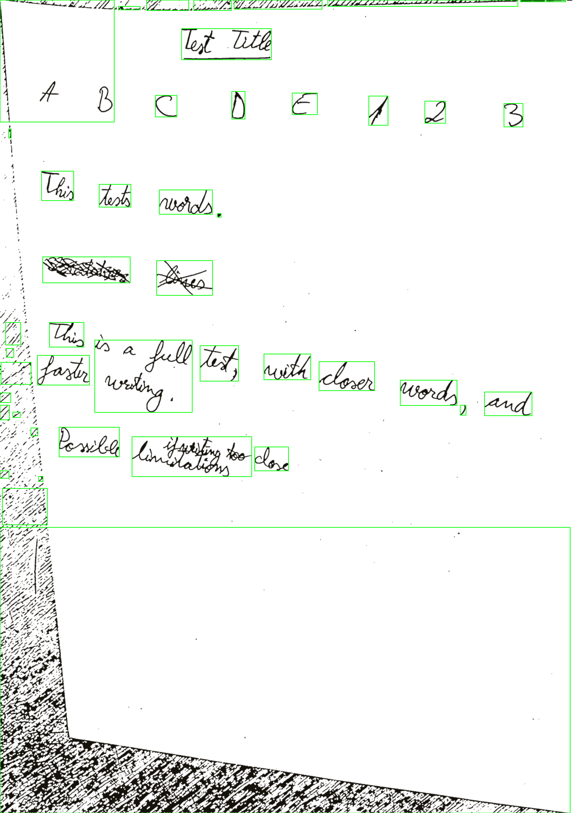  
**Description**: Captured with a clean (CLEAN) background and a right (RIGHT) orientation. The pipeline failed to detect
the document edges accurately, leading to suboptimal results.

---

## **7. Future Work**

- Incorporate AI-based methods for document and text detection.
- Enable multi-page document processing.
- Add support for more complex input scenarios, such as curved documents.
